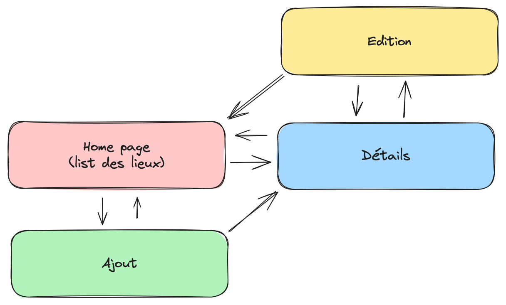
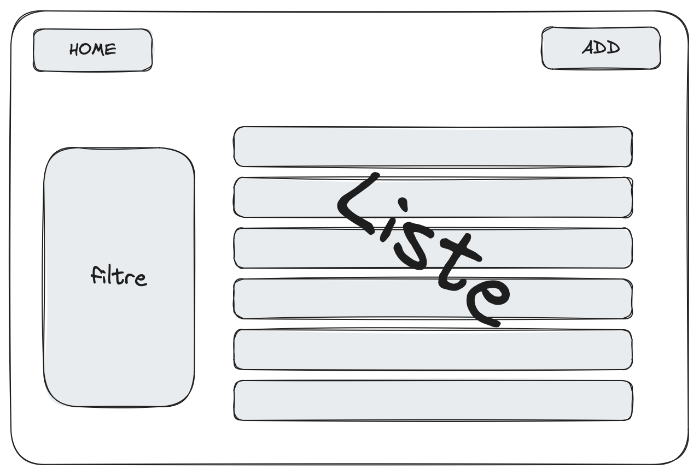
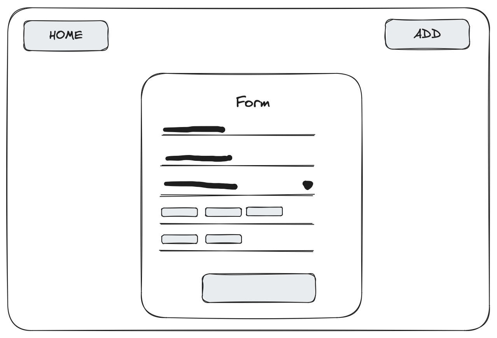
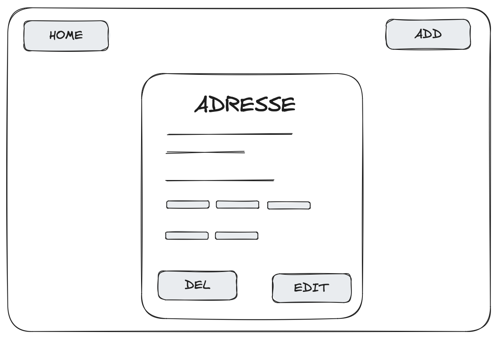

# Cahier des charges fonctionnel

## Introduction

Nous sommes une société qui a pour but de vendre à des boutiques la possibilité de se référencer sur notre site web pour qu'ils puissent attiendre une nouvelle cible qui ne les auraient pas connu autrement. Mais avant de vendre notre service, à des boutiques nous avons besoin d'un minimum d'utilisateurs, pour ensuite pouvoir commercialiser notre service. Il nous faut donc une première version de notre site web qui permettra à des utilisateurs de renseigner des adresses avec des informations les concernants et de les consulter. Les utilisateurs pourront également effectuer des recherches avancées sur les adresses enregistrées en les filtrants.

Le livrable est donc un site web, correctement documenté et fonctionnel. De plus le code doit être correctement organisé et propre dans l'objectif de le maintenir et de sortir des versions futures.

Lors du développement de votre application vous devrez respecter les normes de versionnage décrites dans le manifet "[Sementic Versioning 2.0.0](https://semver.org/lang/fr/)". Que vous versionniez votre application en fonction de la production ou non, vous devrez respecter les règles de versionning de ce manifeste.
> Pour rappel on versionne un projet sous la forme `MAJOR.MINOR.PATCH` où :
> - `MAJOR` est incrémenté lors de changements incompatibles avec les versions précédentes,
> - `MINOR` est incrémenté lors de l'ajout de nouvelles fonctionnalités,
> - `PATCH` est incrémenté lors de corrections de bugs.
>
> Dans un projet node.js vous pouvez utiliser le package [npm version](https://docs.npmjs.com/cli/v7/commands/npm-version) pour versionner votre application ou vous povuez le faire manuellement en modifiant le fichier `package.json` (la clé `version`) de votre projet.

## Site map

---

**La suite du CDCF à pour but de présenter le contenu qui doit absolument être présent dans votre application. Vous pouvez faire soit comme recommandé dans le CDCF** (c'est très fortement encouragé dans un premier temps)**, en faisant des pages pour chaque action de l'utilisateur, soit en faisant des popups ou des side views.**

---

## Layout
Toutes les pages doivent contenir un header :
- avec le logo et un lien vers la page d'accueil,
- un lien vers la page de ajout d'adresse,

Toutes les pages doivent contenir un footer :
- un copyright ou un mail de contact ou des CGU.

## Page d'accueil
La page d'accueil doit contenir un tableau ou une liste des adresses enregistrées, avec l'adresse (courte : numero + rue + ville)
, le lieu dit (nom du lieu), le pays et le type de lieu (ex: restaurant, bar, etc...).
La page devra également contenir un filtre de recherche avancée pour filtrer les adresses enregistrées :
Si L'utilisateur filtre les restaurants, un autre filtre lui proposera les types de cuisine (ex: italien, français, etc...) mais ce filtre ne sera pas proposé pour un musée par exemple.

Exemple de mockup de la page d'accueil :

## Ajout
Cette page est accessible depuis n'importe quelle page du site. Elle doit contenir un formulaire pour ajouter une adresse. Le formulaire doit contenir les champs suivants :
- Adresse (numero + rue + ville),
- Lieu dit (nom du lieu),
- Pays,
- Type de lieu (ex: restaurant, bar, etc...),
- Selon le type de lieu, des champs supplémentaires devront être renseignés (ex: pour un restaurant, le type de cuisine, pour un bar, le type de bar, pour un musée si il est gratuit ou payant, etc...).

Exemple de mockup de la page d'ajout :

## Détail
Cette page est accessible depuis le tableau la page d'accueil en cliquant sur le lieu dont on souhaite les détails. Elle doit contenir les informations renseignées lors de l'ajout de l'adresse. Elle doit également contenir un bouton pour modifier l'adresse et un bouton pour supprimer l'adresse.

Exemple de mockup de la page de détail :

## Modification
Cette page est accessible depuis la page de détail en cliquant sur le bouton de modification. Elle doit contenir un formulaire pré-rempli avec les informations de l'adresse. L'utilisateur pourra modifier les informations et valider le formulaire pour enregistrer les modifications.

> Pro tip : Vous pouvez utiliser la même page et les mêmes compostants que pour l'ajout, en changeant le titre et le bouton de validation.

## Suppression
Vous pouvez faire une page pour confirmer la suppression ou un popup pour confirmer la suppression. Vous pouvez également faire une suppression directe sans confirmation. C'est à vous de voir ce qui est le plus adapté à votre application.

- [ ] Un repository GIT avec le code du site web.
- [ ] le code doit être dans son entièreté sans erreur et formaté ;
- [ ] le code ne doit être « propre » et correctement architecturé,
- [ ] une documentation technique ;
- [ ] la date limite de la livraison finale doit être au plus xxxx après la date de début du projet, délai qui pourra être exceptionnellement prolongé par un accord commun entre les deux parties.