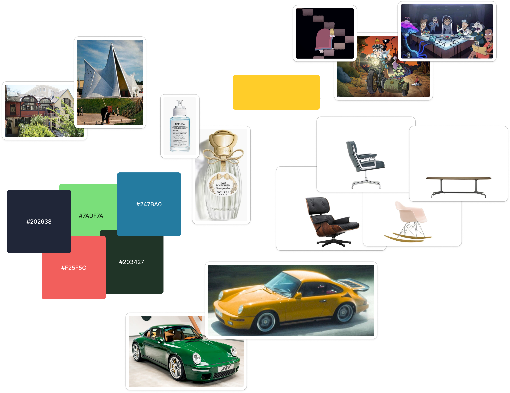
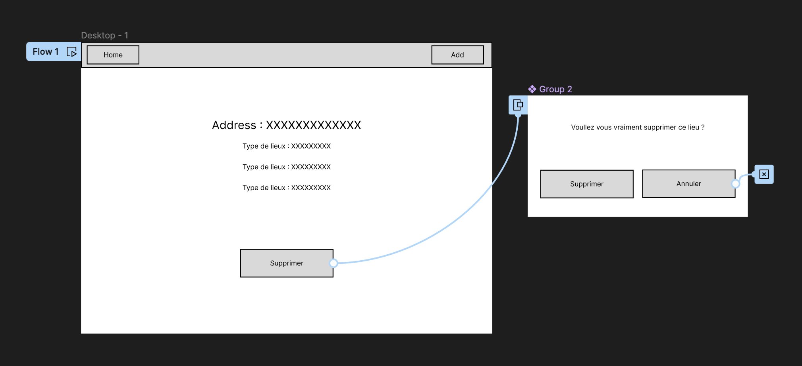
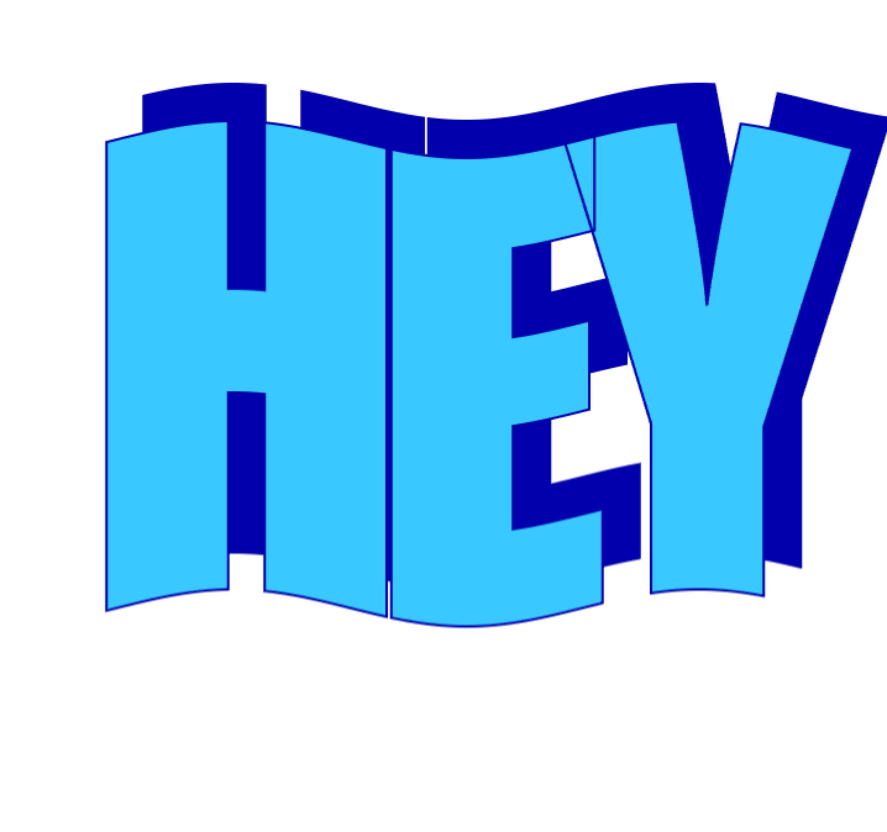
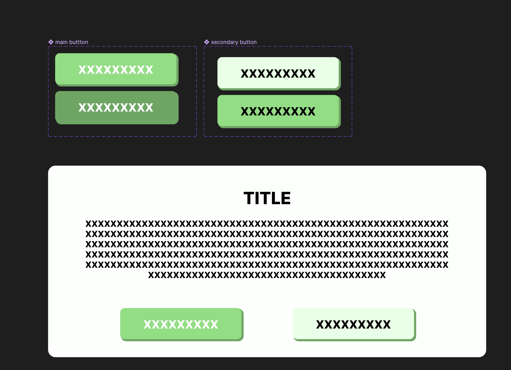

# Cheat sheet: UI/UX
Le but de ce document est de vous donner les bases de l'UI/UX pour que vous puissiez faire des interfaces utilisables et agréables.

## Moodboard
Tout vos projets doivent commencer par un moodboard. C'est une planche d'inspiration qui vous permettra de construire une identité visuelle pour votre application avec de la cohérence. **Il est persque impossible de faire une bonne interface sans moodboard**. Donc comment construire un moodboard ?

### Structure :
Votre moodboard peut soit être une liste soit un tableau ou vous pouvez utiliser des formes plus libres comme avec [Figma](https://www.figma.com/). La forme du moodbaord n'a pas d'importance, ce qui est important c'est que ce moodboard représente votre façon de penser.

### Contenu :
Vous pouvez mettre dans votre moodboard tout ce que vous voullez :
- des couleurs,
- des images,
- des parfums,
- des musiques,
- des poèmes
- des meubles
- des vêtements
- des films
- des jeux vidéos
- des dessins
- ect...
Le but est de représenter au mieux des idées et des ambiances qui vous plaisent.

### Inspiration :
Pour trouver de l'inspiration vous devez vous poser des questions :
- À quoi je pense quand j'imagine mon application ?
- Quelles sont les couleurs qui me viennent à l'esprit ?
- C'est une application pour visiter et découvrir des lieux. Donc que m'inspire la découverte et l'aventure ?
- C'est une application pour des restaurants. Donc que m'inspire la nourriture et les restaurants ?

> Pro tip : Pour les couleurs c'est ce que je fais en dernier car les couleurs sont souvent les plus difficiles à choisir. J'essaie de récuppérer des couleurs que j'apprécie dans les autres images que j'ai misent dans mon moodboard et j'y ajoutes des couleurs dérivées de celles-ci. Si vous avez du mal à choisir des couleurs vous pouvez utiliser des sites comme [coolors](https://coolors.co/) ou [colorhunt](https://colorhunt.co/).

### Exemple :
Voici mon moodboard pour ce projet (le rectangle jaune masque des informations que je ne souhaite pas partager):

Ici ce sont surtout des choses personnels et qui parlent à moi. Le votre doit être à votre image

## Wireframe (Mockup)

Le mockup est une représentation visuelle de votre application. C'est une étape très importante car elle vous permet de visualiser votre application avant de la coder. Cela vous permet de voir si votre application est cohérente et si elle est utilisable.

Pour réaliser un mockup vous pouvez utiliser des outils comme :
- [Figma](https://www.figma.com/)
- [Adobe XD](https://www.adobe.com/fr/products/xd.html)
- [Sketch](https://www.sketch.com/)
- [Invision](https://www.invisionapp.com/)
  

Pour commencer il faut définir un layout : Ce qu'on retrouve sur toutes les pages de l'application. Par exemple un header et un footer.

Ensuite on commence à faires les pages dans leurs globalités. On ne rentre pas dans les détails, on fait juste les grandes lignes.

Et enfin on fini par les popups et les side views.

### Exemple :

Ici c'est la page de détails, avec un header, le détail de l'adresse et une popup pour confirmer la suppression.

L'avantage de le faire avec figma c'est que l'on peut faire des liens entre les pages pour simuler une navigation et ensuite tester l'application au stade de wireframe pour s'assurer que tout est cohérent et accessible.

> Pro tip : Vous pouvez également faire des wireframes pour les versions mobiles et tablettes de votre application.

> Pro tip : Vous pouvez également faire des wireframes pour les états de vos composants (ex: un bouton normal, un bouton hover, un bouton actif, un bouton désactivé, etc...)

> Pro tip : Le but est que l'utilisateurs est le moins de cliques possibles à faire et qu'il soit changé de page le moins souvent possible.

GG ! Votre UX est fini maintenant place à l'UI.

## Choix des couleurs, fonts et formes
C'est le moment le plus difficile selon moi, car il va falloir faire des choix. Pour commencer vous allez avoir besoin de votre moodboard.
Le but est de repérer ce qui vous plait dans chaques images et de les récuppérer pour les mettre dans votre application.

Exemple :
Dans mon moodboard j'ai du mobilier de Charles et Ray Eames, il y a aussi une oeuvre architecturale de Le Corbusier et une autre de Gabor Mester de Parajd. Le point que j'aimes avec ces images, sont leurs côtés très structurés et très géométriques et brut. Je peux donc m'inspirer de ça avec une police très structurée (Serif), je vais aussi utiliser des couleurs plus neutres c'est a dire plus pastels.
À contrario j'ai aussi deux images de porsches (ruf) et des images de cartonn qui dénotent du reste,  je peux donc soit les supprimer si je veux une identité graphique très corporate, soit les garder pour pouvoir mettre en avant des éléments comme mon logo par exemple si j'utilise du WordArt :

Ok maintenant qu'on sait comment choisir des couleurs, des fonts, des formes, on peut passer au design system.

## Design system
Le design system est un ensemble de règles et de composants qui vont permettre de garder une cohérence dans votre application. C'est un peu comme un cahier des charges pour le design de votre application. Par exemple on va définir un bouton accentuée qui sera utilisé pour les actions principales de l'application, un bouton secondaire pour les actions secondaires, un bouton désactivé, etc...

### Exemple :

> Pro tip : Vos composant design sont les mêmes que vos composants React. Vous pouvez donc les coder en même temps que vous les designez mais attention si vous n'êtes pas sur que le résultat final sera concluant attendez d'avoir fini le design pour coder.

> Pro tip : Lisez l'article de Maxime Heckel sur le design system : [Building a Design System from scratch](https://blog.maximeheckel.com/posts/building-a-design-system-from-scratch/)

## UI Final
Maintenant vous pouvez réaliser votre maquette finale en remplacant les wireframes par les éléments de votre design system.
Vous verrez tout de suite ce qu'il faut modifier ou corriger.

Maintenant que vous avez fini votre UI, vous pouvez commencer à coder votre application.